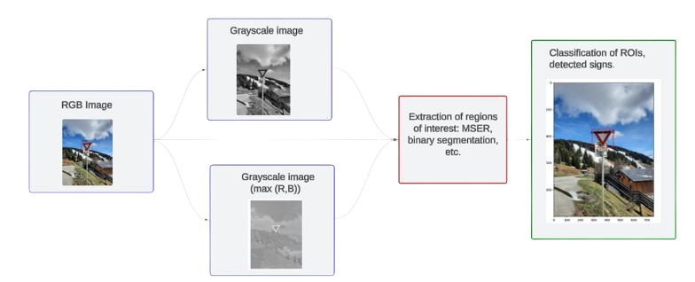

# Traffic Sign Detection and Classification using HOG/SVM
This project was conducted as part of a course on image processing and computer vision. The dataset used in this project was created collaboratively by the entire class, and our approach achieved the best results within the course.
## Project Overview
The goal of this project is to differentiate between various types of traffic signs (danger, prohibition, obligation, stop, yield, and traffic lights) by using traditional image processing techniques. The classical method focuses on leveraging feature extraction techniques, such as Histogram of Oriented Gradients (HOG), combined with machine learning classifiers like Support Vector Machines (SVM) and Random Forests.

Horizontal flipping (50% probability)
Gaussian noise addition (60%)
Median blur (50%)
Brightness and contrast adjustments (40%)
These transformations simulate various conditions and help improve the robustness of the model. As a result, the dataset grew from 800 to 2300 images.

## Feature Extraction
For feature extraction, we used Histogram of Oriented Gradients (HOG). This method captures geometric shapes and contours, which are crucial for identifying traffic signs. The key parameters include:

Cell size: 5x5 pixels
Block size: 2x2 cells
Orientation bins: 8
This results in feature vectors of length 1568 for 40x40 pixel resized images.

## Classification
Two classifiers were tested for traffic sign classification:

**Support Vector Classifier (SVC)**: Achieved 95% accuracy.
**Random Forest**: Achieved 91% accuracy.
While some tests were performed using normalized HSV color histograms, the best results were obtained by relying solely on shape-based features (HOG).

## Detection
For traffic sign detection, a multi-step process was implemented:

**Pyramid Sliding Window**: Initial trials using this approach led to many false positives and high computational costs.

**MSER (Maximally Stable Extremal Regions)**: This algorithm proved to be effective for traffic sign detection by identifying homogeneous regions with high stability under varying lighting conditions. MSER was applied to images with enhanced red and blue channel intensities, isolating potential traffic sign regions.
Additional processing steps include:

**Binary Processing**: Converted images to binary using adaptive thresholding (Otsu) and contour detection to further refine the regions of interest (ROIs).
Non-Maximum Suppression (NMS): Applied after classifying ROIs with HOG/SVM to reduce overlapping bounding boxes.

## Results
Precision: 94.49% with a confidence threshold of 0.95.
Recall: 33.55% at the same confidence threshold.
By lowering the threshold to 0.85, recall increased to 44.86% at the cost of reduced precision (81.73%). This provides a flexible trade-off between accuracy and recall depending on application requirements.

The system processes approximately one image per second on low-powered computers, making it feasible for real-time applications. 
